# 松鼠养殖

## 不带屠宰场版

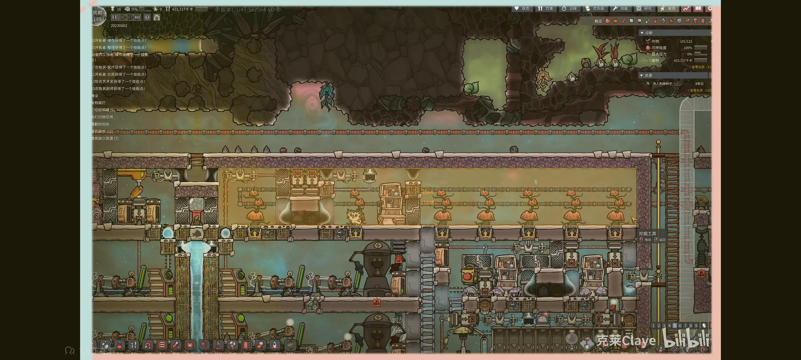

## 带屠宰场版

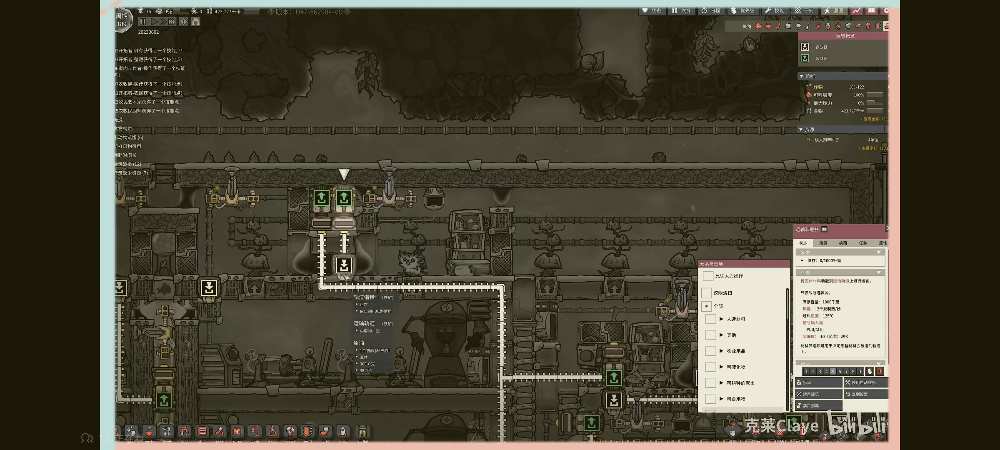

### 自动化

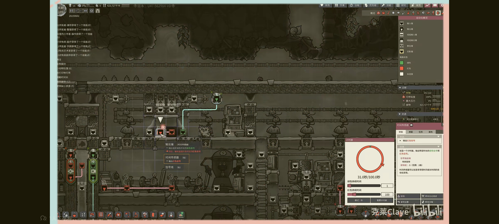

# 壁虎养殖

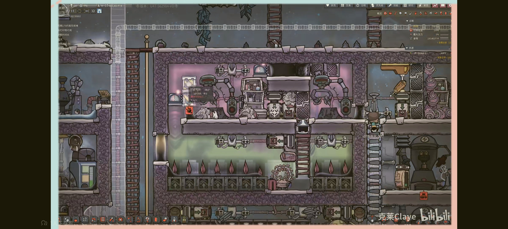

# 田鼠养殖

**注意门需要用钢地砖需要用黑曜石 保证田鼠无法钻出**

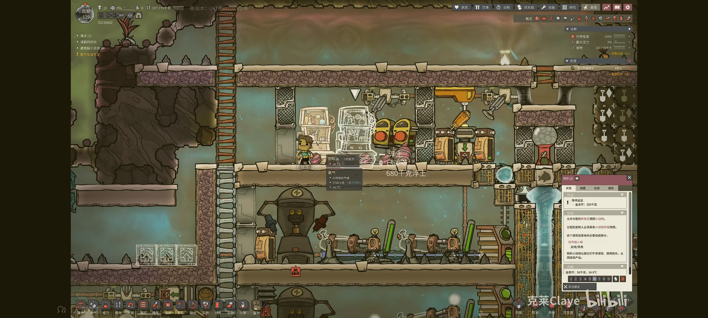

- 缩小版（无运输自动化）

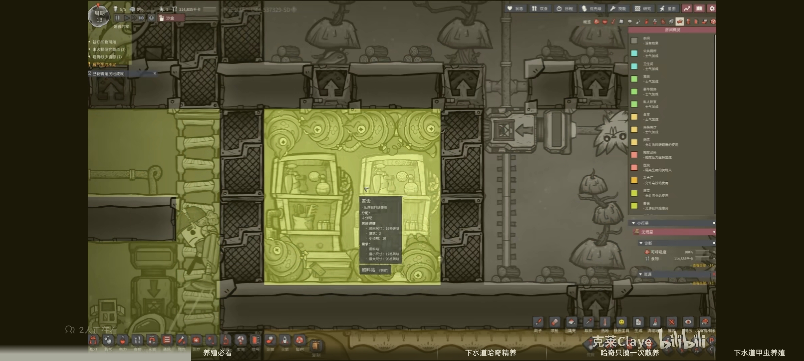

# 哈奇养殖

## 布局

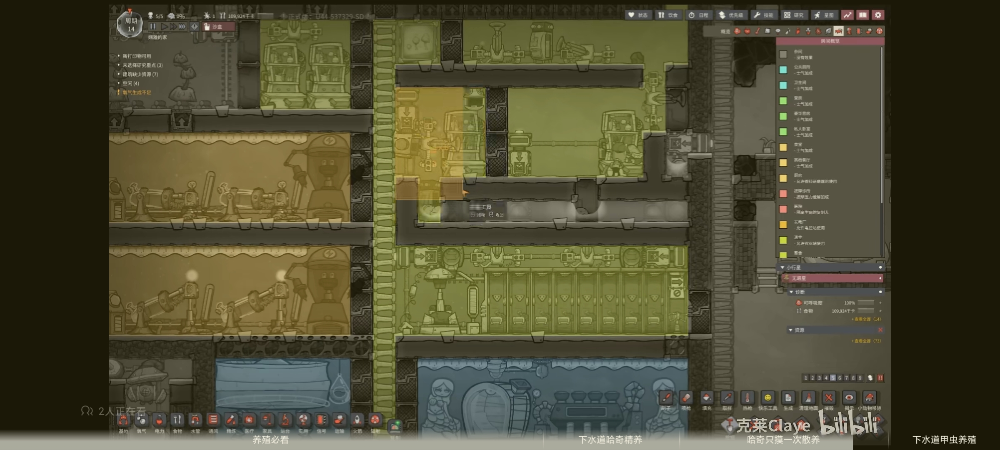

## 自动化

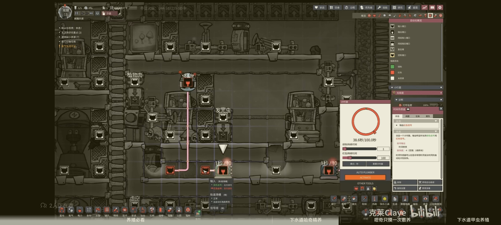

## 运输

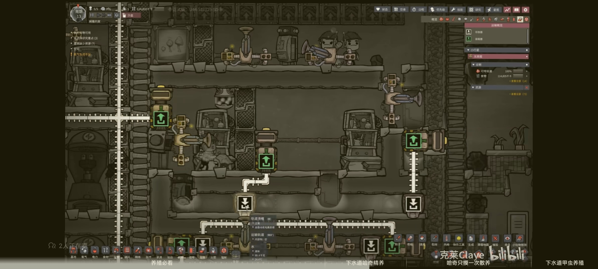

# 滑头养殖

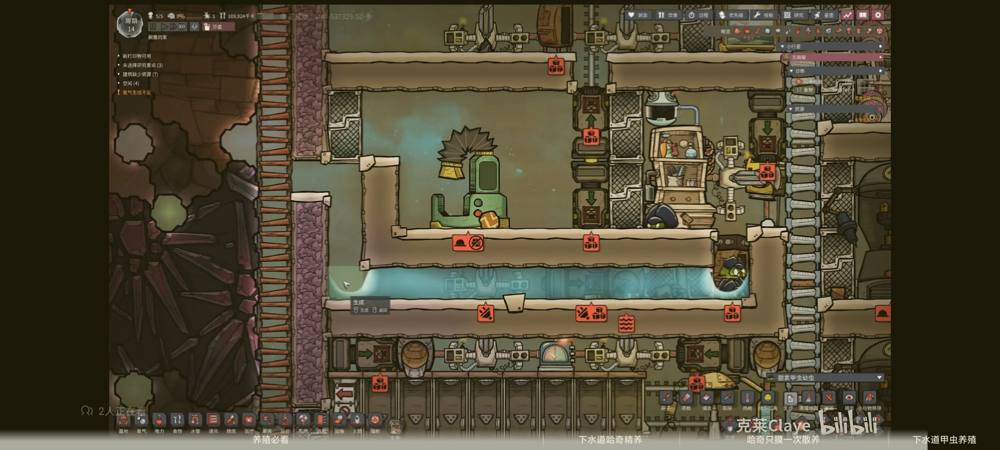

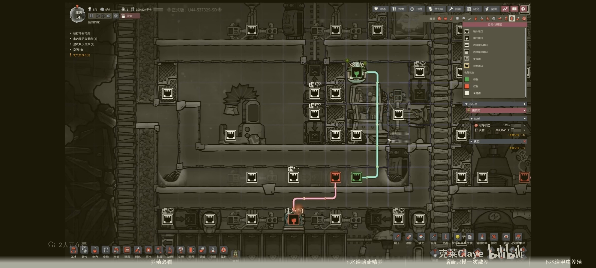

# 养鱼

## 自动化

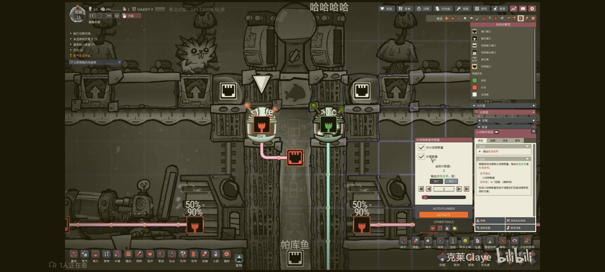

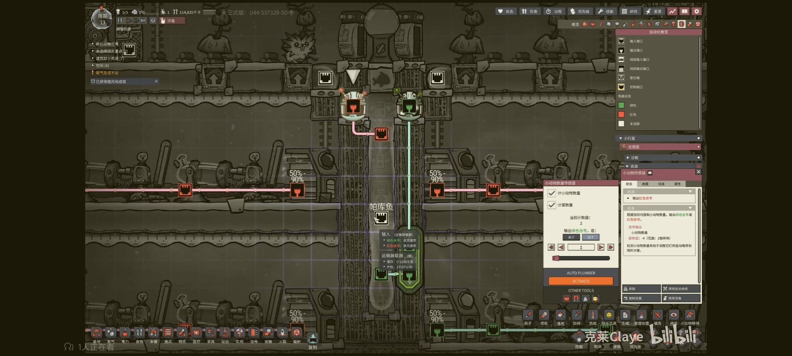

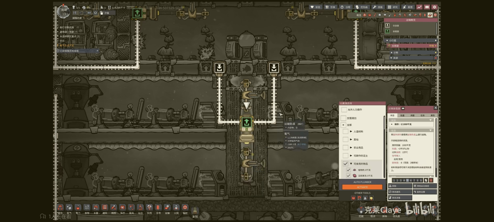

保证在传感器的两格水不足 使得鱼无法游到该地方

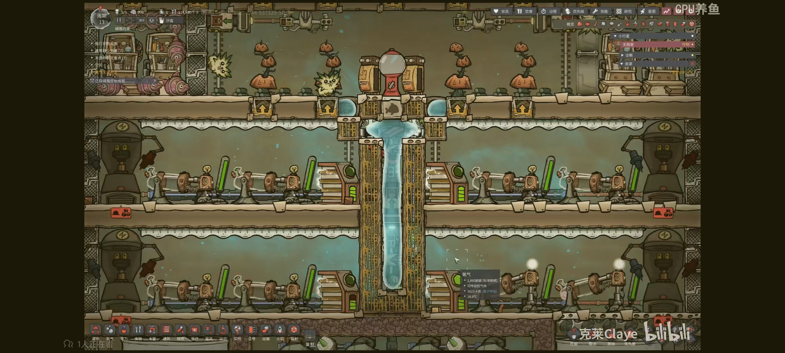